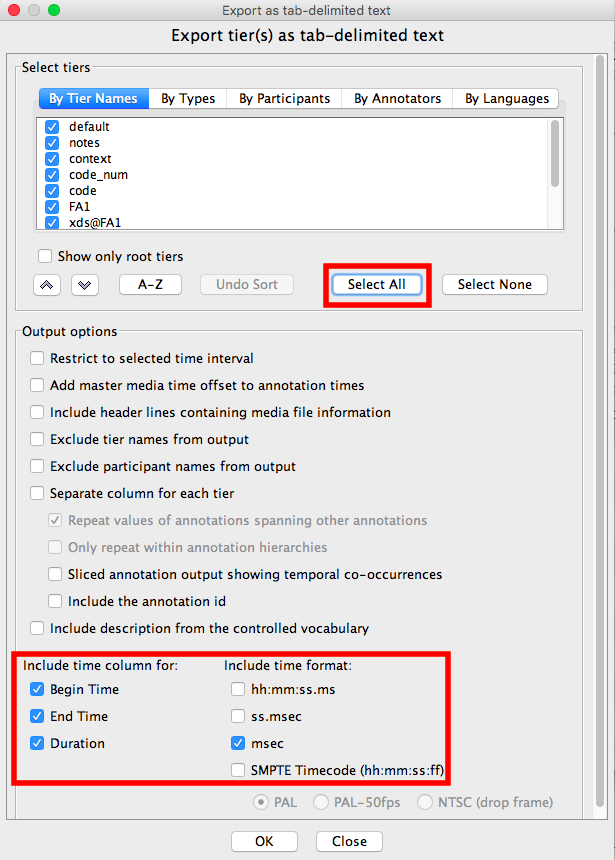
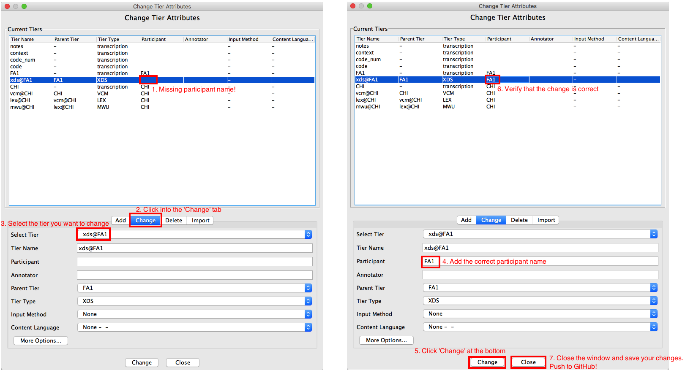

# AAS-minCHAT-Checker
Allows annotators to automatically check for basic minCHAT errors in their transcriptions so that they can manually fix those errors and submit them.

**This script won't catch all the errors!!**

* It only catches errors as described below
* It might even catch some "errors" that are _in reality_ perfectly fine

It is up to you humans to fix those as needed! This is just a tool to help annotators do check the basic ACLEW Annotation Scheme and minCHAT standards used in their annotation files.

## Instructions
1. Locate the .eaf file you want to check; to ensure that you are using the most recent version of your files, clone (recommended) or download the directory of eafs you want to analyze from our shared ACLEW github repo (i.e. rely\_XXX or raw\_XXX).
2. Export the .eaf file you want to check as a tab-delimited text (File > Export As > Tab-delimited text; make sure all tiers are selected); see Figure 1 below.
3. Go to [https://aclew.shinyapps.io/AAS-minCHAT-Checker/]()
4. Upload the file and click **Submit**
5. Download the spreadsheet of possible errors detected; remember, this tool finds potential errors—it is your job to determine whether there are real errors!
6. **REGARDLESS** of whether your file showed potential errors, now check for the following possible issues in your .eaf file:
    - Any tiers that shouldn't belong (a common one is the `default` tier); the only tiers allowed should be speaker and dependent tiers (e.g., `FA1`, `xds@FA1`, `CHI`, `vcm@CHI`, `UC2`, `xds@MA3`, etc.), and the non-speaker tiers used across ACLEW corpora: `context`, `code_num`, `code`, and `notes`. Any tier that has has a name different from these _exact_ options should be deleted of fixed to fit these name options.
    - Go to Tier > Change Tier Attributes... to view a table of your tiers. Check that each tier associated with a speaker (e.g., FA1 and xds@FA1) is associated with the correct participant name (e.g., FA1). If not, fix it. See Figure 2 for details.
7. Problems? See Error Reporting below.

_Figure 1._ Select all tiers and make sure your time column settings are set up as shown below. When prompted about format type for export, select UTF-8.

_Figure 2._ How to check participant assignment and fix any errors.

## What does the checker look for?

It checks to see whether...

* the tier name is either 3 or 7 characters
* the tier name pre- and post-fixes match one of the limited types (e.g., "vcm", "CHI", "FA1")
* there are missing annotations (e.g., a missing LEX annotation when VCM = C)
* there are too many annotations
* the closed-vocabulary annotation values (e.g., XDS, VCM) are valid
* there are empty transcriptions
* transcriptions have too few or too many terminal markers
* the use of square brackets follows one of the following patterns: **[: blabla]**, **\<blabla\> [=! blabla]**, or **[- lng]**
* the use of @ follows one of the following patterns: **blabla@s:eng**, **blabla@l**, or **blabla@c**

## What doesn't the checker look for?

Here's a non-exhaustive list: 
  
* spelling... anywhere
* &=verbs (neither the &= nor the use of present 3ps tense)
* \[=! verbs] (checks the bracket syntax, but not the use of present 3ps tense)
* xxx vs. yyy
* the use of capital letters
* the use of expressive words with special agreed-upong spellings (e.g., mm-hm)
* extra spaces
* uses of hyphens and ampersands to indicate cut-off/restarted speech (e.g., he- or he&, -in or &in)
* the use of things like [+ CHI], that were in some of the ROS files
* matching speaker names across related tiers
* inner tier structure (i.e., correct hierarchical set-up)
  
## Error reporting

Please report any problems you encounter. You can file them under the issues tab of this tool's github repository ([https://github.com/aclew/AAS-minCHAT-Checker/issues]()). When filing an issue, please provide a link to the _exact_ input files you were using as well as a detailed explanation of the problem you encountered. Otherwise we might not be able to re-create the problem and fix it!
